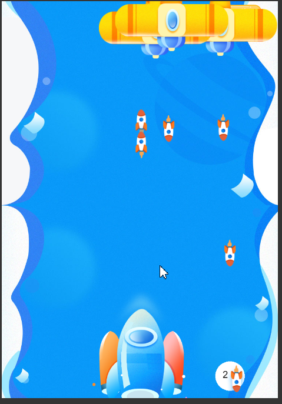

# plane-war

Vue3+canvas 实现飞机大战小游戏

## 启动

1. 构建

```shell
npm run build
```

2. 启动服务

```shell
npm run serve
```

3. 访问 http://localhost:8080 线上地址 [github飞机大战](https://miaomiaofanny.github.io/plane-war/) / [gitee飞机大战](https://fannia.gitee.io/plane-war/)

## 目标: 在canvas上实现飞机大战

1. 基于canvas的Custom Renderer实现
2. canvas 使用 pixi.js

目标具体化: Vue3结合pixi.js实现把图形绘制到canvas上

## tasking

- [x] 页面跳转
  - [x] 开始界面 StartPage
  - [x] 游戏界面 GamePage
  - [X] 重新开始界面 RestartPage
- [x] 背景滚动
- [x] 我方飞机
  - [x] 键盘控制移动
  - [x] 发射子弹
  - [x] 控制子弹数量 最多20
  - [x] 优化: 丝滑移动
  - [x] 优化: 缓动出场
  - [x] 优化: 顺滑出子弹 按住空格键不断出子弹
- [x] 敌方飞机
  - [x] 随机位置出现
  - [x] 每秒出现一辆
  - [x] 控制数量 最多 20 辆
  - [x] 控制子弹数量 最多 100
  - [x] 每秒发射一颗子弹
  - [x] 优化: 随机小步移动
    - [x] 起始向下移动
    - [x] 左右方向随机
    - [x] 不允许飞出游戏界面 碰到边缘反方向移动
  - [x] 优化: 被击中三次才销毁
- [x] 碰撞检测
  - [x] 敌方子弹离开屏幕边缘
  - [x] 我方子弹离开屏幕边缘
  - [x] 敌方子弹碰撞我方飞机
  - [x] 敌方子弹碰撞我方子弹
  - [x] 我方飞机碰撞敌方飞机
  - [x] 我方子弹碰撞敌方飞机
- [x] 高级功能
  - [x] 计数积分
    - [x] 计算 消灭敌方战机数量 3 分/辆
    - [x] 计算 消灭敌方子弹数量 1 分/颗
  - [ ] 历史游戏排行
- [x] 重构
  - [x] 提出键盘事件逻辑
  - [x] 提出帧事件逻辑 addTicer
  - [x] 提出子弹移动逻辑
  - [x] 提出敌机移动逻辑
  - [x] 提出键盘控制本机移动逻辑
- [ ] 测试
- [x] 部署到git pages [参考文章](https://www.cnblogs.com/Marco-hui/p/12155936.html)

## 游戏界面





